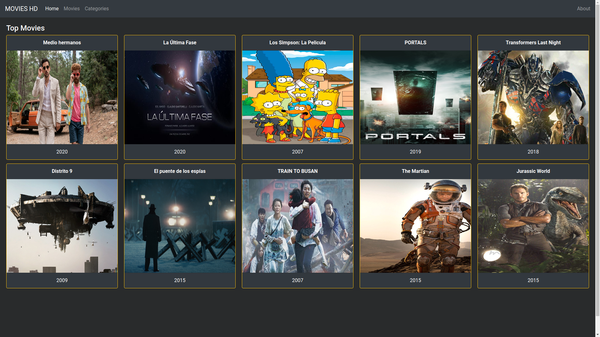
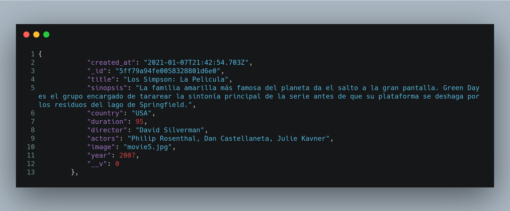

# Movies MEAN

## FRONT END - ANGULAR 11

## API - NODEJS

## REST API

URL  | HTTP Verb | POST Body | Result 
------------- | ------------- | ------------- | -------------
/movies/read  | GET  | empty  | Return all movies
/movies/create | POST   | JSON string  | New movie created
/movies/update/:id  | PUT   | JSON string  | update an existing movie
/movies/delete/:id  | DELETE   | JSON string  | delete an existing movie

## Prerequisites
- node.js
- npm package manager
- MongoDB
- Angular CLI
- Postman

## Start Angular

Run `ng serve` for a dev server. Navigate to `http://localhost:4200/`. The app will automatically reload if you change any of the source files.

## Start API REST Nodejs

Run `npm start` for a dev server. 

